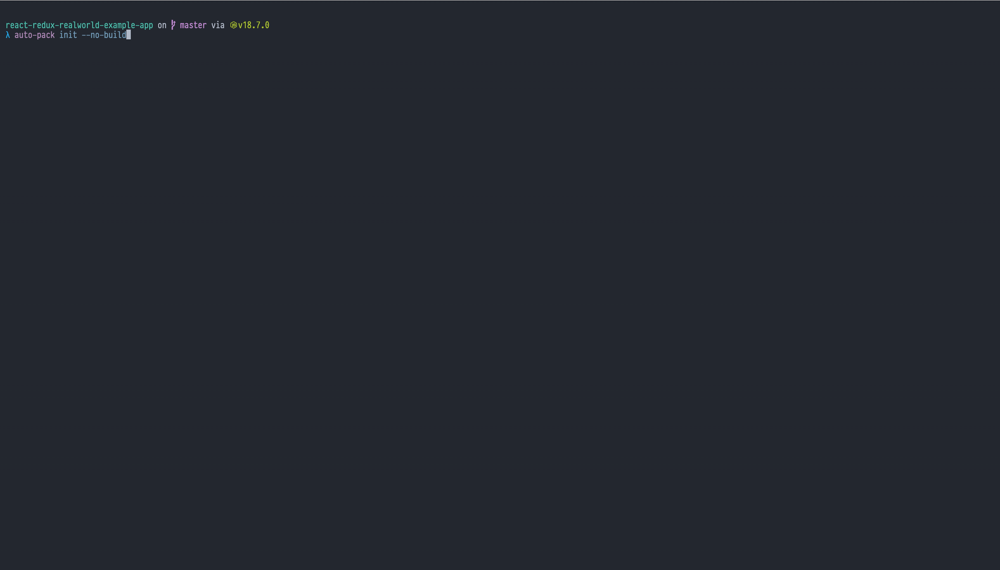
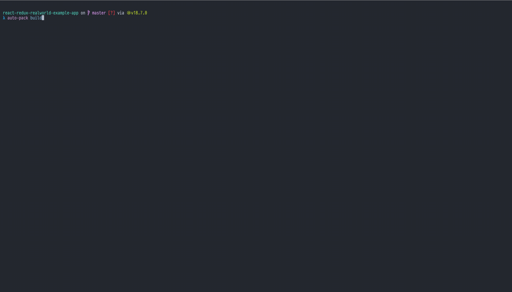
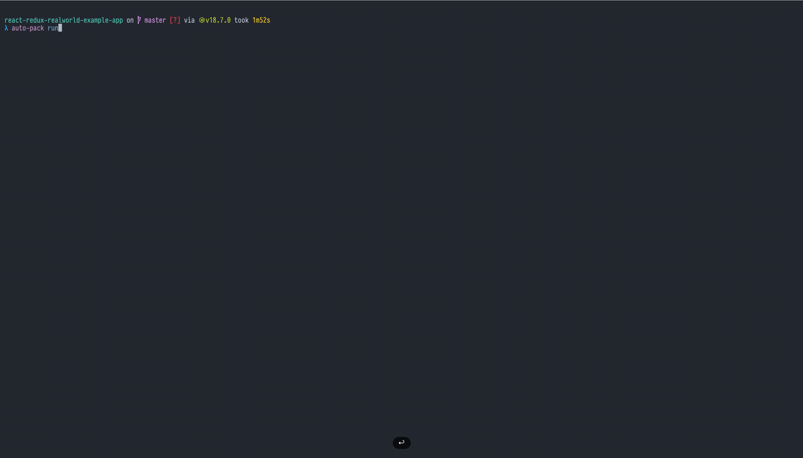

# `autopack`

## About
`autopack` creates Docker/OCI images of a React web application built using Create React App (CRA) tool. All that without any Dockerfile or any Docker mastery. It is available as a command line application (CLI) that run across Windows, Linux, and macOS.

For motivation and other details, check out the [autopack RFC](doc/autopack-rfc.md)

## Installation

Autopack is distributed via the pre-built binaries that one could install from the [Releases page](https://github.com/kaychaks/autopack/releases). Download, unzip, move the unzipped executable to have it available in your terminal's path, and then use the `auto-pack` command from your React project root folder. 

## Pre-requisties

`autopack` relies on Docker to run the built OCI images. So a relevant Docker runtime is required to be installed.

Currently, `autopack` only works for React projects built using CRA. It requires at least the `build` command to be present in the `package.json`.

## Usage

```bash
> auto-pack --help
autopack 0.1.0
Auto Pack CLI

USAGE:
    auto-pack <SUBCOMMAND>

OPTIONS:
    -h, --help       Print help information
    -V, --version    Print version information

SUBCOMMANDS:
    build    Build auto-pack
    help     Print this message or the help of the given subcommand(s)
    init     Initializes auto-pack
    run      Runs auto-pack

```
### Initialization

`autopack` initializes itself on the first run of this command. It will also download and install the required underlying tools. 



### Build

The build command generates the docker image.



### Run

Run the container



## Build from source

`autopack` is a Rust application. Follow the process of quickly setup the Rust development environment [as mentioned here](https://www.rust-lang.org/learn/get-started). And then

```bash
# build
$ cargo build
# run
$ cargo run init
```

